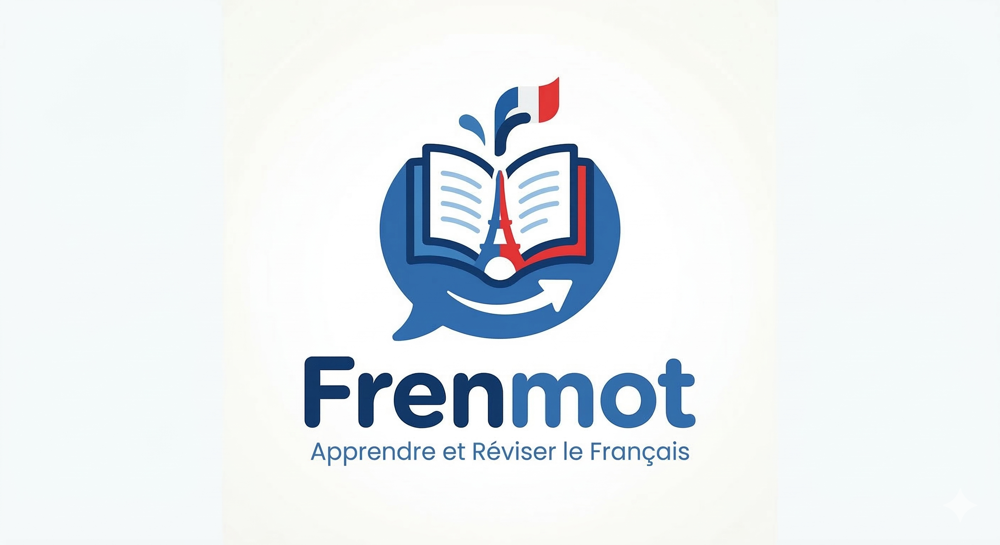

# 🇫🇷 Frenmot — A Personal French Learning Companion

> **Live App →** [frenmot.web.app](https://frenmot.web.app)

*A zero-dependency, offline-first Spanish & French Spaced Repetition System (SRS) built entirely in a single HTML file — syncs directly to your Google Drive.*

I built Frenmot because I was tired of generic language apps that didn't let me learn the words *I actually encountered* while reading French books, watching films, or chatting with native speakers. I wanted something that was mine — a tool where I could paste a page of French text, have an AI extract the hard vocabulary, and then drill those exact words using spaced repetition until they stuck.

So I built it from scratch. No frameworks, no backend, no monthly subscription. Just a fast, offline-first web app that syncs to your Google Drive.



---

## 🧠 Why I Built This

Learning French vocabulary from textbooks felt disconnected from real-world reading. I'd encounter beautiful words like *flâner* (to stroll aimlessly) or *dépayser* (to feel out of place in a foreign land) — words that no Duolingo course teaches — and forget them within days.

I needed a tool that:
- Let me **add my own words** from any source (books, podcasts, conversations)
- **Drilled them scientifically** using spaced repetition (not random quizzes)
- **Worked offline** so I could review on the metro without data
- **Synced across devices** so my progress was never lost
- Had a **conjugation engine** so I could look up any verb without leaving the app

Nothing like this existed in the way I wanted, so I built it.

---

## ✨ Key Features

### 🔁 Spaced Repetition System (SRS)
Every word you add gets scheduled for review using a modified **SM-2 algorithm** — the same scientific method used by Anki. Words you find hard come back sooner; words you ace get pushed further out. The system tracks your `easeFactor`, `interval`, and `repetitions` per word, so your study time is always spent where it matters most.

### 📖 Offline Conjugation Engine
I built a fully offline conjugation engine that handles **3,000+ French verbs** across all tenses and moods — Indicatif, Subjonctif, Conditionnel, Impératif, Participe, and Gérondif. It applies mathematical conjugation rules for Group 1 (`-er`) and Group 2 (`-ir`) verbs, and uses a handcrafted dictionary for the top 16 irregular verbs (être, avoir, aller, faire, etc.). For rare irregular verbs that defy algorithmic conjugation, it gracefully redirects to Le Figaro's conjugation reference.

### ☁️ Google Drive Sync
Your vocabulary and progress are backed up as a JSON file in your personal Google Drive using the `drive.file` OAuth2 scope (minimal permissions — only files the app creates). The sync engine handles:
- **Merge conflicts** — if you add words on two devices before syncing, both sets are preserved
- **Account isolation** — switching Google accounts aggressively wipes the local cache to prevent data cross-contamination
- **Silent re-authentication** — cached tokens avoid the Google popup on every page refresh

### 🤖 AI-Powered Import
Instead of adding words one by one, you can paste an entire French article into ChatGPT, Gemini, or Claude with the built-in prompt template, and import the extracted vocabulary as structured JSON. The app deduplicates automatically.

### 🎯 Interactive Physics UI
The Explore page renders your vocabulary as floating, bouncing word bubbles in a **2D physics simulation** with collision detection. Tap any word to see its definition. It's a playful way to passively absorb your vocabulary while browsing. The engine caps DOM elements dynamically based on viewport size and uses `requestAnimationFrame` with proper cleanup to stay smooth on mobile.

### 🌙 Dark Mode, Themes & i18n
A complete dark theme, **six aesthetic color palettes** swappable from settings (Lavande, Bordeaux, Émeraude, Soleil, Azur, Café), and end-to-end English ↔ French UI localization (every label, dashboard, dialog, alert and dynamically-rendered card flows through a single `t()` translator). Switching language re-renders all dynamic content live.

---

## 🏗️ Technical Architecture

This entire application is a **single `index.html` file** (1,300 lines) with zero build steps, zero dependencies to install, and zero backend servers. Here's why I made that choice and what's under the hood:

### Why Vanilla JS?
I intentionally avoided React, Vue, or any framework. This project was about proving that a complex, production-quality SPA — with OAuth2 authentication, cloud sync, a physics engine, spaced repetition algorithms, and offline-first data management — can be built with nothing but the browser's native APIs. No webpack, no npm install, no node_modules. You open the file and it works.

### The Stack
| Layer | Technology | Why |
|-------|-----------|-----|
| **Structure** | HTML5 semantic elements | Accessibility and SEO |
| **Styling** | Tailwind CSS (CDN) | Rapid prototyping without a build step |
| **Logic** | Vanilla JavaScript (ES6+) | Zero dependencies, maximum control |
| **Auth** | Google Identity Services (GSI) | Industry-standard OAuth2, no custom auth server needed |
| **Cloud Storage** | Google Drive REST API | Free, personal, no backend required |
| **Hosting** | Firebase Hosting | Free tier, global CDN, automatic SSL |
| **Translation** | MyMemory API | Free auto-translation for quick word lookups |

### Security Hardening
The codebase has been through a focused security review covering:
- **XSS Prevention** — All user-generated content (imported words, definitions) is escaped via a dedicated `escapeHtml()` function before any DOM insertion. This prevents malicious JSON payloads from executing scripts.
- **Session Isolation** — Switching Google accounts triggers an aggressive cache wipe (`localStorage`, `sessionStorage`, in-memory state) to guarantee zero data leakage between users on shared devices.
- **Race Condition Guards** — The Google Drive sync function uses a concurrency lock (`isSyncing`) to prevent parallel sync calls from corrupting data during slow network responses.
- **Input Validation** — Both `localStorage` state and imported JSON are validated and sanitized before use, preventing crashes from corrupted data.

---

## 📂 Project Structure

```
Frenmot/
├── index.html        # The entire application — HTML + CSS + JS (1,300 lines)
├── verbs.json        # Offline database of 3,000+ French verbs across 3 conjugation groups
├── app_logo.png      # Custom application logo
├── firebase.json     # Firebase Hosting configuration
├── .firebaserc       # Firebase project alias
└── .gitignore        # Standard exclusions for Firebase projects
```

---

## 🚀 Run It Yourself

No install required. Just clone and serve:

```bash
git clone https://github.com/YOUR_USERNAME/Frenmot.git
cd Frenmot
npx -y serve .
```

Then open `http://localhost:3000`. To use Google Sign-In locally, add `http://localhost:3000` to your Authorized JavaScript Origins in the [Google Cloud Console](https://console.cloud.google.com/apis/credentials).

### Deploy to Firebase

```bash
npm install -g firebase-tools
firebase login
firebase deploy
```

---

## 📈 What I Learned Building This

- **OAuth2 in the browser is nuanced.** Managing token expiry, silent re-auth, cross-account contamination, and the UX of consent popups taught me more about real-world auth flows than any tutorial.
- **Spaced repetition is elegant math.** The SM-2 algorithm is deceptively simple (a few lines of code), but getting the UX right — showing intervals on buttons, handling edge cases for new vs. mature words — required careful thought.
- **Security is a mindset, not a checklist.** The XSS vulnerability I found during review came from a `${variable}` inside `innerHTML` — a pattern that looks harmless until you realize the variable could contain ``. I now instinctively reach for `textContent` first.
- **Offline-first changes everything.** Merge conflicts between local and cloud state are the real engineering challenge. Deciding *which* streak count to keep when two devices sync with different values requires deliberate design, not just "last write wins."

---

## 📄 License

This project is open-source under the **[MIT License](LICENSE)**. Feel free to fork it, modify it, or use it to learn your own target language.
